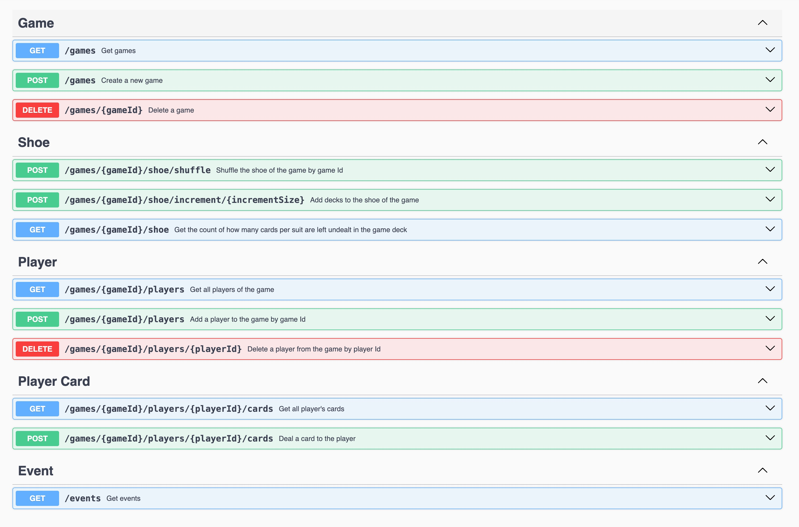
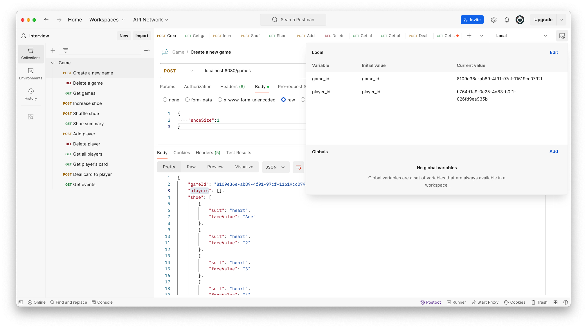

# Tech Stack
- Java 21
- Spring Boot 3.2.4
- Lombok 1.18.32
- Mockito 5.11.0

# Clarification And Assumption
Since this is a homework, I can not clarify requirements with you. So, I have made some decisions based on my understanding.

1. I assume that there could be tens of thousands of games going on simultaneously, with no more than 20 players in each game, and the shoe size for each game not exceeding 10 decks.

2. The assignment mentioned only one REST API should be implemented. I assume this REST API contains multiple endpoints. Implementing all features with a single REST API endpoint would not comply with REST API design guidelines. GraphSQL can achieve that, but it's not a REST API. So I decided to use multiple endpoints.

3. Although the assignment mentions that the "create a deck" operation must be provided, I believe this endpoint is unnecessary because the content of a deck is fixed (52 cards with fixed face values and suits). My solution is to allow the creation of decks when creating a game, where the number of decks can be specified in the request body. Additionally, I provide another endpoint to add decks to an existing game. 

4. I assume that players can have the same name. Therefore, I won't check for duplicated requests when adding a player, as I cannot determine if it's a duplicate player.

# How To Run

## Run endpoints in Swagger page
[Local 8080 sagger page link](http://localhost:8080/swagger-ui.html)

## Run endpoints in Postman
Import file [Game.postman_collection.json](Game.postman_collection.json) and [Local.postman_environment.json](Local.postman_environment.json) to your postman.

